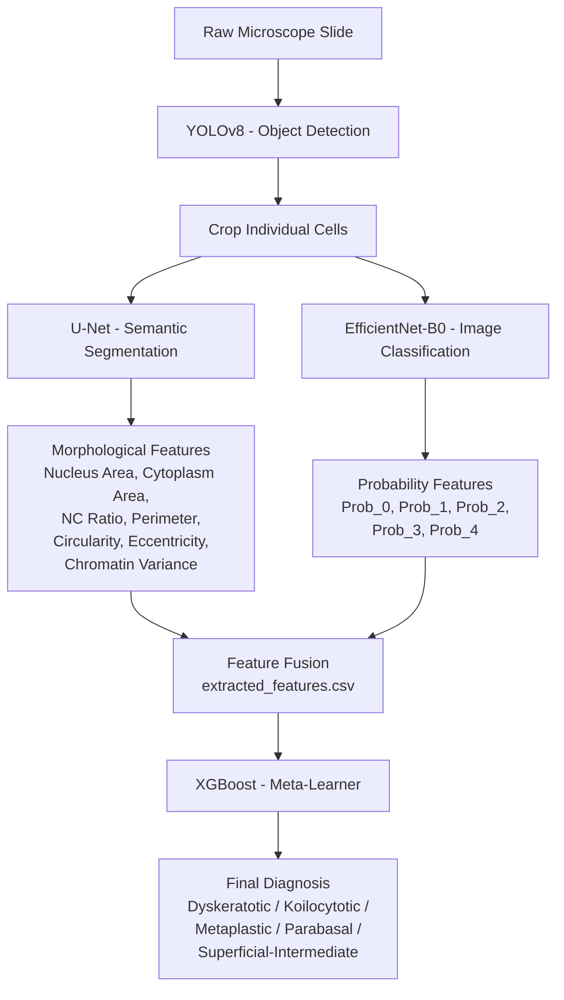
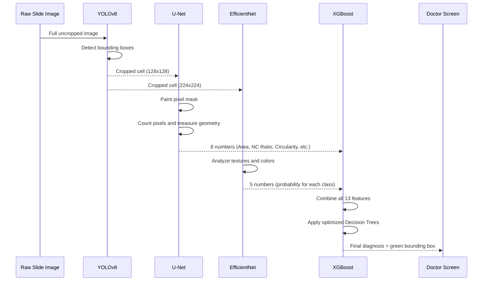
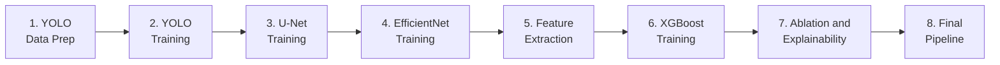
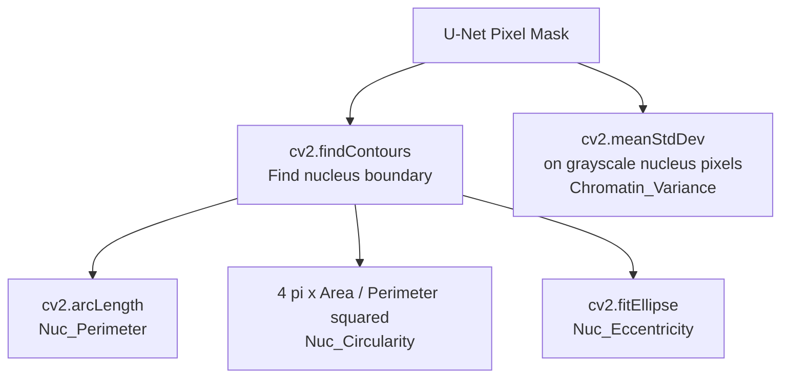

# SIPaKMeD: AI-Powered Cervical Cancer Detection Pipeline

## Complete Project Documentation

## 1. What Is This Project?

This project builds an **automated cervical cancer screening system** using Deep Learning. A doctor places a microscope slide under a camera, and our AI pipeline automatically:

1. **Finds** every individual cell on the slide
2. **Measures** the physical size and shape of each cell's nucleus
3. **Analyzes** the visual texture and color patterns of each cell
4. **Diagnoses** whether each cell is normal, pre-cancerous, or abnormal

The system classifies cells into **5 medical categories**:

| Class | Name | What It Means |
|-------|------|---------------|
| 0 | Dyskeratotic | Abnormal cells with hardened keratin — a sign of dysplasia |
| 1 | Koilocytotic | Cells with a "halo" around the nucleus — linked to HPV infection |
| 2 | Metaplastic | Normal cells that changed shape due to irritation (benign) |
| 3 | Parabasal | Small, round immature cells from deeper tissue layers |
| 4 | Superficial-Intermediate | Healthy, mature cells from the surface layer (normal) |

---

## 2. Why Do We Need Four AI Models?

A single AI model cannot reliably diagnose cancer alone. Just like a real hospital has specialists, our system uses **four different AI "doctors"**, each with a specific job:

| Model | Role | What It Does |
|-------|------|-------------|
| **YOLOv8** | The Receptionist | Finds and isolates individual cells from a messy slide |
| **U-Net** | The Biologist | Measures the physical size, shape, and geometry of the nucleus |
| **EfficientNet-B0** | The Pathologist | Reads the visual textures and color patterns of the cell |
| **XGBoost** | The Chief Medical Officer | Listens to U-Net and EfficientNet, then makes the final call |

> **Key Insight:** U-Net looks at *physical structure*. EfficientNet looks at *visual texture*. Neither alone is enough. By fusing them together through XGBoost, we get a system that is both accurate AND robust.

---

## 3. System Architecture

The following diagram shows the complete architecture of the system. Data flows from top to bottom, starting with a raw microscope image and ending with a medical diagnosis.



---

## 4. Data Flow: Step by Step

This diagram shows exactly how a single cell image travels through the entire pipeline during inference (Notebook 8):



---

## 5. The 8 Notebooks — What Each One Does and Why

### Overview



---

### Notebook 1: 1_YOLO_Data_Preparation.ipynb

**Purpose:** Convert the raw SIPaKMeD dataset into the exact folder structure that YOLOv8 expects.

**Why this step exists:**  
YOLOv8 is very picky about how its training data is organized. It needs:
- An `images/` folder with the photos
- A `labels/` folder with `.txt` files describing where each cell is located (bounding box coordinates)
- A `data.yaml` file telling YOLO which classes exist

The raw SIPaKMeD dataset stores cell boundaries in `.dat` files as polygon coordinates. This notebook reads those `.dat` files, converts the polygon coordinates into rectangular bounding boxes, and writes them out as YOLO-format `.txt` label files.

**Input:** Raw SIPaKMeD dataset (`Dataset/` folder)  
**Output:** YOLO-formatted dataset (`processed_data/yolo_dataset/`)

---

### Notebook 2: 2_YOLO_Training.ipynb

**Purpose:** Train YOLOv8 to detect and locate individual cells on a microscope slide.

**Why this step exists:**  
Real microscope slides contain dozens of cells scattered randomly. Before we can classify a cell, we need to *find* it first. YOLO learns to draw a tight bounding box around each cell, isolating it from the background clutter.

**How it works:**
- Loads the YOLOv8 nano model (pre-trained on general objects)
- Fine-tunes it on our cervical cell images for 50 epochs
- YOLO learns that cells are round-ish blobs on a purple/pink background

**Input:** YOLO-formatted dataset  
**Output:** Trained YOLO weights (`runs/detect/sipakmed_yolo/weights/best.pt`)

---

### Notebook 3: 3_UNet_Segmentation.ipynb

**Purpose:** Train U-Net to paint a pixel-perfect mask over each cell, separating the Nucleus from the Cytoplasm.

**Why this step exists:**  
One of the most important medical indicators for cervical cancer is the **Nucleus-to-Cytoplasm (NC) Ratio**. Cancer cells have abnormally large nuclei relative to their cytoplasm. To measure this ratio, we need to know *exactly* which pixels belong to the nucleus and which belong to the cytoplasm. U-Net does this by classifying every single pixel into one of three categories:

| Pixel Class | Value | Color in Mask |
|------------|-------|--------------|
| Background | 0 | Black |
| Cytoplasm | 1 | Green |
| Nucleus | 2 | Red |

**How it works:**
- Uses a ResNet-34 encoder (pre-trained on ImageNet) for powerful feature extraction
- Trains for up to 50 epochs with Early Stopping to prevent overfitting
- Learns to outline the nucleus boundary with pixel-level precision

**Input:** Cropped cell images + ground truth masks  
**Output:** Trained U-Net weights (`trained_models/unet/unet_sipakmed.pth`)

---

### Notebook 4: 4_EfficientNet_Classification.ipynb

**Purpose:** Train EfficientNet-B0 to classify cell images into the 5 medical categories based on visual texture.

**Why this step exists:**  
While U-Net can measure physical sizes, it cannot read *texture*. Two cells can be the exact same physical size but one is cancerous (its chromatin looks grainy and dark) while the other is healthy (its chromatin is smooth and light). EfficientNet is a Google-designed CNN that excels at reading these subtle visual patterns.

**How it works:**
- Loads EfficientNet-B0 pre-trained on ImageNet (transfer learning)
- Replaces the final classification layer with a 5-class output
- Uses heavy Data Augmentation (random flips, rotations, color jitter) to prevent memorization
- Trains for up to 50 epochs with Early Stopping

**Input:** Cropped cell images organized by class  
**Output:** Trained EfficientNet weights (`trained_models/cnn/efficientnet_sipakmed.pth`)

---

### Notebook 5: 5_Feature_Extraction.ipynb

**Purpose:** Pass every image through both U-Net and EfficientNet to extract a table of numbers.

**Why this step exists:**  
XGBoost (our final decision-maker) cannot look at images. It only understands rows and columns of numbers. This notebook acts as a **translator**: it takes the visual knowledge from U-Net and EfficientNet and converts it into a spreadsheet that XGBoost can read.

**What gets extracted for each cell image:**

| Feature | Source | What It Measures |
|---------|--------|-----------------|
| `Nuc_Area` | U-Net | How many pixels the nucleus covers |
| `Cyt_Area` | U-Net | How many pixels the cytoplasm covers |
| `Total_Area` | U-Net | Nucleus + Cytoplasm combined |
| `NC_Ratio` | U-Net | Nucleus size divided by Cytoplasm size |
| `Nuc_Perimeter` | OpenCV | The length of the nucleus boundary |
| `Nuc_Circularity` | OpenCV | How round the nucleus is (1.0 = perfect circle) |
| `Nuc_Eccentricity` | OpenCV | How elongated/oval the nucleus is |
| `Chromatin_Variance` | OpenCV | How rough/grainy the nucleus texture is |
| `Prob_0` to `Prob_4` | EfficientNet | Confidence percentage for each of the 5 classes |

**Input:** All cropped cell images + trained U-Net + trained EfficientNet  
**Output:** `processed_data/extracted_features.csv` (one row per cell, 13 feature columns)

---

### Notebook 6: 6_XGBoost_and_Evaluation.ipynb

**Purpose:** Train XGBoost to make the final medical diagnosis by combining U-Net's measurements with EfficientNet's opinions.

**Why this step exists:**  
EfficientNet gives us 5 probability numbers. U-Net gives us 8 physical measurement numbers. But which numbers matter more? Should we trust the shape of the nucleus or the texture? XGBoost is a **gradient-boosted decision tree** that automatically learns the optimal way to weigh and combine all 13 features.

**How it works:**
1. Loads `extracted_features.csv`
2. Splits data 80/20 into Training and Testing sets
3. Runs **GridSearchCV** with 72 hyperparameter combinations x 3-fold cross-validation = **216 total model fits**
4. Picks the best-performing combination and saves the final model
5. Generates evaluation charts:
   - **Confusion Matrix:** Shows exactly which classes the AI confuses
   - **Feature Importance Chart:** Reveals which of the 13 features the AI relies on most
   - **ROC Curve:** The medical gold standard for evaluating diagnostic sensitivity

**Input:** `extracted_features.csv`  
**Output:** Trained XGBoost model (`trained_models/xgboost_sipakmed.json`)

---

### Notebook 7: 7_Ablation_and_Explainability.ipynb

**Purpose:** Scientifically prove that our multi-model architecture is justified, and visually explain *why* the AI makes its decisions.

**Why this step exists:**  
A professor or medical reviewer will ask two critical questions:
1. *"Why did you use 4 models? Isn't that overkill?"* — The **Ablation Study** answers this.
2. *"How do I know the AI isn't just guessing?"* — **Grad-CAM** answers this.

**Part 1: Ablation Study**  
We deliberately cripple the system to prove every component matters:

| Test | What We Do | Expected Result |
|------|-----------|----------------|
| EfficientNet Alone | Use only CNN probabilities, no XGBoost | High accuracy but fragile |
| U-Net Alone | Use only physical measurements | Lower accuracy (size alone is not enough) |
| CNN + XGBoost | CNN probabilities fed through XGBoost | Better than CNN alone |
| **Full Ensemble** | All 13 features through XGBoost | **Best overall, most robust** |

We run this test **twice**: once on clean data, and once on corrupted data (simulating 15% blurry/low-quality images). This proves the Full Ensemble is the most robust to real-world noise.

**Part 2: Grad-CAM (Explainable AI)**  
Grad-CAM hooks into EfficientNet's final convolutional layer and generates a thermal heatmap showing exactly which pixels the AI focused on when making its diagnosis. Red pixels = "I stared at this." Blue pixels = "I ignored this." If the red zone is over the nucleus, the AI learned real biology.

**Input:** `extracted_features.csv` + trained EfficientNet  
**Output:** Side-by-side grouped bar chart + Grad-CAM heatmap overlay

---

### Notebook 8: 8_Final_Pipeline.ipynb

**Purpose:** The fully automated deployment script. Feed it a raw microscope image and get a diagnosed image back.

**Why this step exists:**  
Everything we built in Notebooks 1-7 was training and analysis. Notebook 8 is the **actual product**. It loads all 4 models into GPU memory simultaneously and runs the complete pipeline end-to-end:

```
Raw Image -> YOLO (find cells) -> U-Net (measure) -> EfficientNet (analyze) -> XGBoost (diagnose) -> Annotated Image
```

The output is the original slide image with green bounding boxes drawn around each detected cell and the medical diagnosis written as text above each box.

**Input:** Any raw microscope slide image  
**Output:** Annotated image with per-cell diagnoses

---

## 6. Training Details

### U-Net Training Summary
- **Architecture:** U-Net with ResNet-34 encoder (pre-trained on ImageNet)
- **Input Size:** 128 x 128 pixels
- **Classes:** 3 (Background, Cytoplasm, Nucleus)
- **Epochs Trained:** 24 out of 50 (Early Stopping triggered)
- **Best Validation Accuracy:** ~93.12%
- **Optimizer:** Adam
- **Loss Function:** CrossEntropyLoss

### EfficientNet Training Summary
- **Architecture:** EfficientNet-B0 (pre-trained on ImageNet)
- **Input Size:** 224 x 224 pixels
- **Classes:** 5 (the 5 cell types)
- **Epochs Trained:** 21 out of 50 (Early Stopping triggered)
- **Best Validation Accuracy:** ~97.41%
- **Optimizer:** Adam
- **Data Augmentation:** Random horizontal/vertical flip, rotation, color jitter

### XGBoost Training Summary
- **Algorithm:** Gradient Boosted Decision Trees (XGBClassifier)
- **Tuning Method:** GridSearchCV (exhaustive, not random)
- **Total Combinations Tested:** 72 hyperparameter sets x 3 folds = 216 fits
- **Best Hyperparameters Found:**
  - `learning_rate`: 0.1
  - `max_depth`: 5
  - `n_estimators`: 100
  - `subsample`: 1.0
  - `colsample_bytree`: 1.0
- **Hardware:** NVIDIA RTX 4050 GPU (`tree_method='hist'`, `device='cuda'`)

---

## 7. Feature Engineering: Advanced Morphological Features

In addition to basic area measurements, we extract advanced geometric features using pure OpenCV mathematics on the U-Net segmentation mask:



**Why these features matter medically:**

| Feature | Medical Significance |
|---------|---------------------|
| **Perimeter** | Cancerous nuclei often have irregular, jagged edges |
| **Circularity** | A perfect circle = 1.0. Cancer nuclei are less circular |
| **Eccentricity** | Measures how oval vs round. Cancer cells are more elongated |
| **Chromatin Variance** | Rough, uneven chromatin distribution is a hallmark of dysplasia |

---

## 8. Project Directory Structure

```
SIPaKMeD/
|
|-- Dataset/                          # Original raw SIPaKMeD images
|   |-- im_Dyskeratotic/
|   |-- im_Koilocytotic/
|   |-- im_Metaplastic/
|   |-- im_Parabasal/
|   |-- im_Superficial-Intermediate/
|
|-- processed_data/                   # All processed/generated data
|   |-- yolo_dataset/                 # YOLO-format training data
|   |   |-- images/
|   |   |-- labels/
|   |   |-- data.yaml
|   |-- cnn_dataset/                  # Cropped cells for EfficientNet
|   |-- unet_dataset/                 # Images + masks for U-Net
|   |-- extracted_features.csv        # The fused feature table
|
|-- trained_models/                   # All saved model weights
|   |-- unet/
|   |   |-- unet_sipakmed.pth
|   |-- cnn/
|   |   |-- efficientnet_sipakmed.pth
|   |-- xgboost_sipakmed.json
|
|-- runs/                             # YOLO training output
|   |-- detect/sipakmed_yolo/
|       |-- weights/best.pt
|
|-- notebooks/                        # All 8 Jupyter notebooks
|   |-- 1_YOLO_Data_Preparation.ipynb
|   |-- 2_YOLO_Training.ipynb
|   |-- 3_UNet_Segmentation.ipynb
|   |-- 4_EfficientNet_Classification.ipynb
|   |-- 5_Feature_Extraction.ipynb
|   |-- 6_XGBoost_and_Evaluation.ipynb
|   |-- 7_Ablation_and_Explainability.ipynb
|   |-- 8_Final_Pipeline.ipynb
|
|-- README.md
```

---

## 9. Why This Architecture? (The Big Picture)

The fundamental question behind this project is: **Why not just use one model?**

Here is the reasoning, step by step:

1. **EfficientNet alone gets ~97-99% accuracy.** That sounds amazing. But it only looks at *textures*. If the microscope is out of focus or the staining is slightly different, its accuracy drops. It has no backup plan.

2. **U-Net alone gets ~53% diagnostic accuracy.** Physical size alone cannot distinguish cancer cells. But U-Net provides something EfficientNet cannot: *objective physical measurements* that are immune to image quality.

3. **By fusing both through XGBoost**, we create a system where:
   - If the image is clear, EfficientNet dominates and accuracy is near-perfect
   - If the image is blurry, U-Net's physical measurements compensate for EfficientNet's confusion
   - XGBoost learns the optimal balance automatically

4. **The Ablation Study in Notebook 7 proves this empirically** by testing the system on both clean and corrupted data. The Full Ensemble is consistently the most robust.

This is called **Multi-Modal Feature Fusion** in the research literature, and it is the gold standard approach for medical AI systems where reliability matters more than raw speed.

---

## 10. How to Run the Project

### Prerequisites
- Python 3.8+
- NVIDIA GPU with CUDA support (tested on RTX 4050)
- All dependencies installed via `sipakmed_env` virtual environment

### Execution Order
Run the notebooks **in numerical order**. Each notebook depends on the output of the previous one:

```
Notebook 1 -> Notebook 2 -> Notebook 3 -> Notebook 4 -> Notebook 5 -> Notebook 6 -> Notebook 7 -> Notebook 8
```

> **Important:** If you change anything in Notebook 5 (feature extraction), you must re-run Notebooks 6, 7, and 8 because they all depend on the `extracted_features.csv` file.

